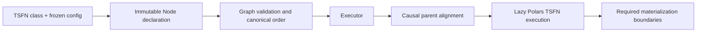

# Extending iosislib

This guide is for contributors adding a new time-series function (TSFN) or a
new supervised model implementation. It describes the contracts that make an
extension compatible with iosislib's graph validation, causal execution, and
deterministic identities. Read it together with the repository-level
[contribution constraints](../AGENTS.md); those constraints are part of the
project's architecture, not merely style guidance.

## The execution model

iosislib is a typed, deterministic computation graph over Polars time-series
frames. A program declares immutable `Node` values; `Graph` validates the
declaration; an `Executor` runs the validated graph. Polars performs the
columnar work. The library owns the parts whose meaning must stay stable across
programs and executions:



`Node` declares a versioned TSFN, its configuration, named bindings to parent
outputs, and *consumer-owned* policies such as as-of tolerances and null
handling. It does not execute. `Graph` rejects invalid bindings, incompatible
schemas/time axes, and cycles before execution. `Executor` aligns every bound
input and calls the TSFN. `LocalExecutor` is the current sequential runtime;
executors are passed to `graph.execute(executor=...)`, never stored in graph
identity.

An inputless source is an ordinary TSFN whose input signature is exactly
`FrameSignature.empty()`. It has no special node class and is called without a
frame. Every other TSFN receives the frame assembled from its bound parents.

### Causal alignment

For a child node with bindings, the executor projects each requested parent
output with its parent time column, sorts it, and builds the sorted union of all
parent timestamps. It then backward-`join_asof`s each projection using the
tolerance declared by the **child** for that input. Consequently:

- no timestamp supplied by a parent is dropped by default;
- a value is never taken from the future;
- rows before a parent's first observation are null;
- omitted tolerance means an unbounded backward match.

Do not implement cross-parent alignment inside a normal TSFN. Declare the
inputs and let the graph provide the causally aligned frame. A TSFN may sort
when its own operation needs ordered rows (for example, `Delta` does), but it
must preserve its declared time contract.

## Contracts shared by every TSFN

The base APIs live in [`src/iosislib/core/tsfn.py`](../src/iosislib/core/tsfn.py).
Every concrete TSFN must satisfy all of these requirements.

1. Define a non-empty, behavior versioned `VERSION` string. Change it whenever
   externally observable behavior changes.
2. Define `CONFIG_CLS` as a frozen dataclass subclassing `TSFNConfig`. Validate
   parameter structure in `__post_init__`; use `TypeError` for incompatible
   types and `ValueError` for invalid values/structure.
3. Implement `type_signature()` and return exactly
   `(input_frame_signature, output_frame_signature)`.
4. Implement `apply()` so it returns a `pl.LazyFrame`. Do not collect ordinary
   transforms internally.
5. Emit exactly the declared output physical schema, including column order.
   The base class validates both input and output schema.

`Node(SomeTSFN, config=SomeConfig(...))` is the preferred typed construction
path. `parameters={...}` remains supported for dynamic callers and normalizes
to the same configuration and identity.

### Frame signatures and physical data

`FrameSignature` declares a time axis separately from value columns. Its
`columns` field is a tuple, never a list. A value column is declared as either
`(name, dtype)` or `(name, element_dtype, shape)`. A shape is physical storage
metadata: `(2, 3)` is stored as a flat `pl.Array(element_dtype, 6)`. It does
not introduce a tensor type or broadcasting semantics.

```python
import polars as pl

from iosislib.core.tsfn import FrameSignature, TimeAxis

prices = FrameSignature(
    time=TimeAxis(column="timestamp", dtype=pl.Datetime, timezone="UTC"),
    columns=(("mid", pl.Float64), ("levels", pl.Float64, (5,))),
)
```

The time name, time dtype, and timezone must match across a binding. Dtype
matching is structural and conservative: parameterized types such as
`pl.List(pl.Int64)` and `pl.Array(pl.Float64, 5)` must match their parameters.
Do not treat bare `pl.List`, `pl.Array`, or `pl.Datetime` classes as broad
wildcards. The time column is metadata, not a value column available for
binding.

### Nulls, identity, and materialization

Polars null means missing or invalid—not zero, NaN, or an empty array. A node
can select per-input `NullPolicy.ERROR`, `PROPAGATE`, `DROP`, `FILL`, `PASS`,
or a named custom function. Defaults and explicit defaults intentionally have
the same identity. `FILL` needs an explicit fill value; fill values for any
other handler are rejected. A custom handler must be a top-level named function
and needs an explicit behavior version (on `NullHandler`, on the node mapping,
or as `function.__iosis_version__`).

Node IDs include the TSFN's qualified class name and version, resolved
signatures, normalized config, bindings, tolerances, effective null handlers
and applicable fill values, materialization choice, and outputs. Avoid
process-local values, unordered semantics, non-finite values, random defaults,
or mutable state in any value that reaches a config or checkpoint. If a behavior
change changes identity-relevant output, bump the relevant version rather than
reusing the old one.

`TSFN.REQUIRES_MATERIALIZATION` is a minimum. `Node(materialize=True)` adds a
boundary, but cannot remove one required by the TSFN. Ordinary transforms
should stay lazy. `BatchTSFN` requires materialization by design and is the
right base for a full-frame operation, not a reason to eagerly collect an
otherwise vectorized transform.

## Choose the narrowest TSFN base class

| Operation shape | Base class | Implement |
| --- | --- | --- |
| One input, scalar or fixed-array elementwise operation | `ItemwiseUnaryTSFN` | input/output names and `itemwise_expr(pl.Expr)` |
| N-input, elementwise operation | `ItemwiseStructTSFN` | input/output names and `batch(fields) -> pl.Series` |
| Full-frame or external batch operation | `BatchTSFN` | `batch(frame) -> pl.DataFrame` |
| Source or another operation not covered above | `TSFN` | `type_signature()` and lazy `apply()` |

`ItemwiseUnaryTSFN` carries a bound input's shape through to its output and
uses `arr.eval(pl.element())` for fixed arrays. `ItemwiseStructTSFN` accepts a
struct batch of its declared fields; its inputs must have equal shapes unless it
overrides `resolve_output_shape()`. Keep itemwise work in Polars expressions or
batched series operations. Avoid `map_elements`, Python row loops, and trees of
`arr.get` expressions.

### A complete unary-transform pattern

This is a small transform in the style expected by the graph. It works for a
scalar `Float64` input and for a bound fixed-size `Float64` array because the
base class resolves the shape and evaluates the expression elementwise.

```python
from dataclasses import dataclass

import polars as pl

from iosislib.core.tsfn import (
    FrameSignature,
    ItemwiseUnaryTSFN,
    TSFNConfig,
    TimeAxis,
)


@dataclass(frozen=True)
class SquareConfig(TSFNConfig):
    input_column: str = "value"
    output_column: str = "squared"
    timestamp_column: str = "timestamp"

    def __post_init__(self) -> None:
        for name in (self.input_column, self.output_column, self.timestamp_column):
            if not isinstance(name, str):
                raise TypeError("column names must be strings")
            if not name.strip():
                raise ValueError("column names must be non-empty")
        if self.timestamp_column in (self.input_column, self.output_column):
            raise ValueError("the time column cannot be a value column")


class Square(ItemwiseUnaryTSFN[SquareConfig]):
    VERSION = "1.0.0"
    CONFIG_CLS = SquareConfig

    def type_signature(self) -> tuple[FrameSignature, FrameSignature]:
        params = self.parameters
        return (
            FrameSignature(
                time=TimeAxis(params.timestamp_column),
                columns=((params.input_column, pl.Float64),),
            ),
            FrameSignature(
                time=TimeAxis(params.timestamp_column),
                columns=((params.output_column, pl.Float64),),
            ),
        )

    def itemwise_input_column(self) -> str:
        return self.parameters.input_column

    def itemwise_output_column(self) -> str:
        return self.parameters.output_column

    def itemwise_expr(self, value: pl.Expr) -> pl.Expr:
        return value * value
```

Use it in a declaration rather than invoking it as an execution object:

```python
from iosislib.core.graph import Graph
from iosislib.core.node import Node

square = Node(
    Square,
    config=SquareConfig(input_column="price", output_column="price_squared"),
    bindings={"price": source.output("price")},
    name="square_price",
)
result = Graph(square).execute()
```

The binding key must exactly match the TSFN input column name. Prefer
`parent.output("name")` when clarity matters; `parent.name` is equivalent sugar.
The graph will reject missing, extra, or incompatible bindings before it runs.

### Sources and batch operations

For a source, declare `FrameSignature.empty()` for input and implement
`apply(self) -> pl.LazyFrame`; `Node` will have no bindings. Source adapters may
perform I/O, but graph-visible behavior must be governed by versioned parameters
and deterministic input data. Local CSV/Parquet sources are deliberately byte
snapshot based: they hash and parse the same captured bytes, so do not replace
that guarantee with an independent hash/read path.

For a `BatchTSFN`, implement `batch(frame) -> pl.DataFrame` instead of
overriding lazy execution. Treat the supplied `DataFrame` as immutable, return
the entire declared output frame, and expect predicate/projection/slice pushdown
to be disabled at the boundary. `BatchTSFN` defaults to `NullPolicy.ERROR`; use
that default for model-like operations unless a different policy has a clear
domain meaning.

## Add a new supervised model type

A supervised model has two layers:

1. A `SupervisedModel` is an immutable, serializable checkpoint. It validates
   input/output nulls and row count around `_predict()`. Its `_fit()` method
   receives train and optional validation datasets and **must return a new
   checkpoint**, never mutate and return itself.
2. A `SupervisedModelTSFN` is the graph operation that supplies walk-forward
   fitting and prediction. It is a `BatchTSFN`, so it is always a
   materialization boundary and defaults to loud null failure.

The TSFN's input signature must have exactly `("features", "target")`, in that
order, and its output signature exactly `("prediction",)`. It must preserve the
same time axis. `features` is normally a fixed-width `pl.Array`; build it with
an ordinary upstream graph TSFN. Do not add a separate model-dataset graph
concept or bind the time column as an input.

At runtime the model TSFN sorts the graph-established time axis, asks its
`Scheduler` for a segment boundary, optionally trains on only the historical
prefix, predicts the next segment, and makes that segment's metrics available
to the next scheduling decision. It never trains on the segment it is about to
predict. `DatasetSplitter` partitions the historical prefix; it does not create
causality on its own.

### Checkpoint and model-TSFN skeleton

```python
from collections.abc import Mapping
from dataclasses import dataclass
from typing import ClassVar

import polars as pl

from iosislib.core.model import (
    Dataset,
    DatasetSplitter,
    Scheduler,
    SupervisedModel,
    SupervisedModelTSFN,
)
from iosislib.core.tsfn import FrameSignature, TSFNConfig, TimeAxis


@dataclass(frozen=True, kw_only=True)
class MeanCheckpoint(SupervisedModel):
    VERSION: ClassVar[str] = "1.0.0"
    mean: float = 0.0

    def _fit(
        self,
        train: Dataset,
        validation: Dataset | None,
        *,
        seed: int,
    ) -> SupervisedModel:
        del validation, seed
        targets = pl.concat(
            [batch.get_column("target") for batch in train.batches()]
        )
        mean = targets.mean()
        if mean is None:
            raise ValueError("training data must contain a target mean")
        return MeanCheckpoint(mean=float(mean))

    def _predict(self, features: pl.Series) -> pl.Series:
        return pl.repeat(self.mean, len(features), dtype=pl.Float64, eager=True)


@dataclass(frozen=True)
class MeanModelConfig(TSFNConfig):
    feature_width: int
    scheduler: Scheduler
    splitter: DatasetSplitter
    seed: int = 17

    def __post_init__(self) -> None:
        if isinstance(self.feature_width, bool) or self.feature_width < 1:
            raise ValueError("feature_width must be a positive integer")


class MeanModelTSFN(SupervisedModelTSFN):
    VERSION = "1.0.0"
    CONFIG_CLS = MeanModelConfig

    def type_signature(self) -> tuple[FrameSignature, FrameSignature]:
        width = self.parameters.feature_width
        time = TimeAxis("timestamp")
        return (
            FrameSignature(
                time=time,
                columns=(("features", pl.Float64, (width,)), ("target", pl.Float64)),
            ),
            FrameSignature(time=time, columns=(("prediction", pl.Float64),)),
        )

    def initial_model(self) -> SupervisedModel:
        return MeanCheckpoint()

    def scheduler(self) -> Scheduler:
        return self.parameters.scheduler

    def splitter(self) -> DatasetSplitter:
        return self.parameters.splitter

    def training_seed(self, retrain_count: int) -> int:
        return self.parameters.seed + retrain_count

    def segment_metrics(
        self, target: pl.Series, prediction: pl.Series
    ) -> Mapping[str, float]:
        mse = ((target - prediction) ** 2).mean()
        assert mse is not None
        return {"mse": float(mse)}
```

Configure this model with a deterministic splitter and scheduler, for example
`ChronologicalSplitter(...)` and `EveryNTicksScheduler(...)`. A custom
`Scheduler` implements `_decide(context)` and returns a `ScheduleDecision` that
advances the cursor without exceeding the data. A custom `DatasetSplitter`
implements `_split(frame, *, seed)` and returns a valid `DatasetSplit` using
only canonical `features` and `target` columns. Checkpoint state and configs
must serialize deterministically; if an implementation stores external weights,
the path/content reference becomes part of its explicit checkpoint state.

The complete, tested reference pattern—including an upstream feature packer and
walk-forward assertions—is in
[`tests/test_supervised_model_tsfn.py`](../tests/test_supervised_model_tsfn.py).
For production examples using LightGBM and a dense MLP, see
[`src/iosislib/models`](../src/iosislib/models).

## Tests required for a contribution

Place new tests in `tests/test_*.py`. Add both success and failure coverage;
the following is the minimum review checklist.

- Config rejects wrong types, invalid values, and unknown/missing mapping keys.
- Signatures reject wrong time name/dtype/timezone, value dtype, physical array
  width, and extra or reordered output columns.
- Graph construction rejects missing, extra, wrong-type, and wrong-output
  bindings, plus cycles where relevant.
- Alignment tests prove union-timeline behavior, backward-only matching,
  tolerance expiry, and expected leading nulls.
- Null-policy tests cover the extension's default plus every policy it supports,
  including custom handler versioning where used.
- Identity tests show semantically equivalent typed/mapping configuration has the
  same ID and behavior/version/config changes have different IDs.
- Itemwise tests cover scalar and shaped values; batch/model tests cover schema,
  materialization, repeatability, and deterministic seeds.
- Model tests prove prediction row count and dtype, no null predictions, an
  immutable replacement checkpoint, and no training on future rows.

Run the relevant narrow test first, then the project gates from the repository
root:

```console
python -m compileall -q src/iosislib examples
python -m ruff check src examples
python -m mypy
python -m pytest
```

## Common integration mistakes

| Do | Avoid |
| --- | --- |
| Declare all named input/output contracts up front. | Reading graph state or a consumer from a TSFN. |
| Let the executor align parent outputs causally. | Joining parent frames inside a normal transform. |
| Use native Polars expressions or one batched operation. | Python per-row loops, `map_elements`, or eager collection. |
| Make config, checkpoint state, and versions deterministic. | Random defaults, hidden mutable state, or process-local identity. |
| Treat model fit as a new immutable checkpoint. | Mutating model weights in place. |
| Add a materialization boundary only when the operation requires it. | Making all nodes eager or allowing a TSFN to disable its required boundary. |

The library is intentionally not a generic workflow orchestrator, a backtester,
or a strategy compiler. Do not add caching, Ray concerns, a `SourceNode`
hierarchy, `GraphEdge` wrappers, a compiled-graph duplicate type, or broad
bitemporal semantics while implementing a TSFN or model. If an extension needs
one of those capabilities, raise it as a separate architectural proposal with a
concrete operation and invariant it enables.
